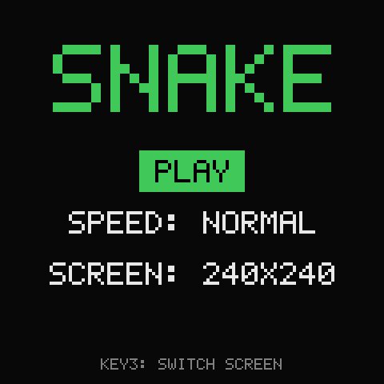
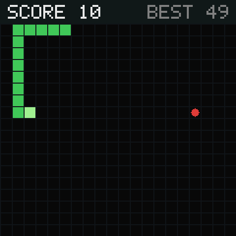
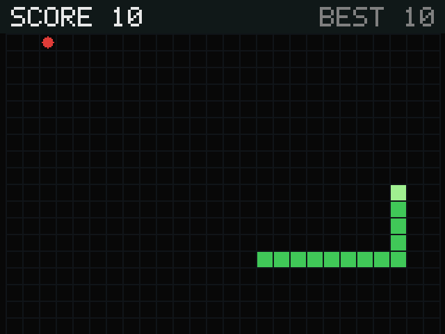
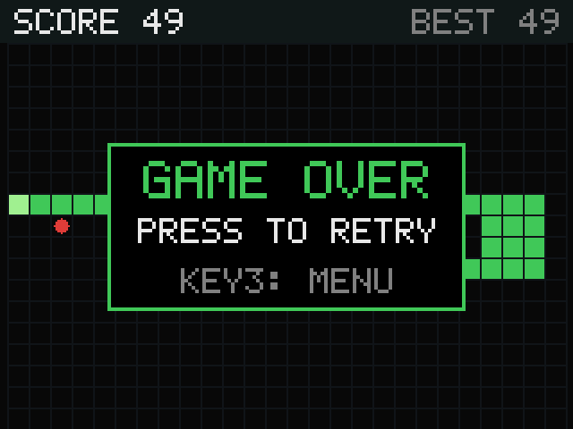

# snake-os

A tiny bootable SD card image that turns a Raspberry Pi Zero with a small SPI
LCD hat into a dedicated snake game. Power it on and it boots straight into the
game; there is nothing else on it.

- The game is a single C file (`src/snake.c`) with no dependencies beyond libc.
- The OS is a minimal [Buildroot](https://buildroot.org) system that runs
  entirely from RAM: Linux kernel, BusyBox and the game. No Python, no
  networking, no camera stack.
- The image is about 20 MB.

<p align="center">
  
  
</p>
<p align="center">
  
  
</p>

## Supported hardware

| Part | Supported |
|---|---|
| Board | Raspberry Pi Zero v1.3 or Zero W (BCM2835). The Zero 2 W is **not** supported by this image. |
| Screen | ST7789 240x240 (e.g. Waveshare 1.3" LCD HAT) or ST7789 320x240, selectable in the menu |
| Controls | 5-way joystick + KEY1/KEY2/KEY3, wired as on the Waveshare 1.3" LCD HAT |

## Installing

1. Download `snake_os.<version>.pi0.img` from the [Releases](../../releases) page.
2. Flash the `.img` to a microSD card with Raspberry Pi Imager or a similar tool.
4. Insert the card and power on. The game appears within a few seconds.

## Playing

| Where | Control | Action |
|---|---|---|
| Menu | Joystick up/down | Choose PLAY, SPEED or SCREEN |
| Menu | Press joystick or KEY1 | Select / change |
| Menu | Joystick left/right | Change SPEED or SCREEN |
| Menu | **KEY3** | Switch screen type (works even if the screen is unreadable) |
| Game | Joystick | Steer |
| Game | KEY2 | Pause |
| Paused | KEY2 / KEY3 | Resume / back to menu |
| Game over | Press joystick or KEY1 / KEY3 | Play again / back to menu |

**Screen type:** the image starts in 240x240 mode. If you have a 320x240
screen and the display looks scrambled, press KEY3 once. The choice is saved to
`game.cfg` on the SD card, so it sticks as long as the card stays inserted.

## Building it yourself

```bash
git clone --recursive https://github.com/sesi-the-man/snake-os.git
cd snake-os
docker compose run --rm build
```

Full instructions, including Apple Silicon Macs and reproducible builds, are in
[docs/BUILDING.md](docs/BUILDING.md).

## Repository layout

| Path | What it is |
|---|---|
| `src/snake.c` | The game |
| `br2-external/` | Buildroot configuration: defconfig, board files, kernel/BusyBox configs, game package |
| `patches/` | Patches applied during the build (a FAT `nodirty` mount option for the kernel) |
| `buildroot/` | Buildroot, pinned as a git submodule |
| `build.sh`, `Dockerfile`, `docker-compose.yml` | Build tooling |
| `docs/` | Building, releasing and repository setup instructions |

## Licenses

The files in this repository are MIT licensed (see [LICENSE](LICENSE)). The
built image also contains third-party software under its own licenses,
including the Linux kernel and BusyBox (GPL-2.0), glibc (LGPL-2.1+) and the
Raspberry Pi boot firmware, which is a closed-source binary distributed under
Broadcom's redistribution license. Each release includes a `legal-info` archive
with the license texts and corresponding source code for everything in the
image.

## Credits

The build system, kernel configuration and board setup are adapted from
[SeedSigner OS](https://github.com/SeedSigner/seedsigner-os) (MIT).
